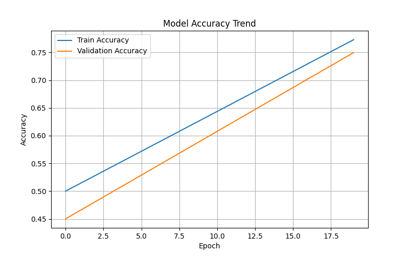

🌫️ Fog Density & Visibility Prediction System.
Using Hybrid AIS + PSO Deep Learning Model.
📌 Overview

Fog significantly impacts transportation safety, aviation operations, logistics, and urban mobility. This project introduces a Fog Density & Visibility Prediction System built using a Hybrid Artificial Immune System (AIS) + Particle Swarm Optimization (PSO) model.

The hybrid optimizer fine-tunes neural network hyperparameters, improving accuracy and generalization for fog classification based on meteorological data.

The system outputs:

Fog Density Level

Visibility Class

Prediction Confidence

Comparison Graphs

Result Plots

Confusion Matrix

Model Training Curves

Saved Hybrid Model: hybrid_fog_model.h5

🎯 Key Features

✔️ Hybrid AIS + PSO meta-heuristic optimization
✔️ Deep learning classifier optimized automatically
✔️ Full training pipeline (train/val/test)
✔️ Visualizations for:

Accuracy curve

Loss curve

Confusion matrix

Predictions vs actual

Performance comparison

✔️ Saves:

hybrid_fog_model.h5

hybrid_fog_model.json

hybrid_fog_model_info.json

All plots with hybrid_*.png prefix

🏗️ Project Architecture
├── data/
│   ├── fog_dataset.csv
│   └── city_attributes.csv
├── graphs/
│   ├── hybrid_accuracy.png
│   ├── hybrid_loss.png
│   ├── hybrid_confusion_matrix.png
│   ├── hybrid_prediction_plot.png
│   └── hybrid_results.png
├── model/
│   ├── hybrid_fog_model.h5
│   ├── hybrid_fog_model.json
│   └── hybrid_fog_model_info.json
├── fog_hybrid_training.py
└── README.md

📊 Datasets Used

You can choose any meteorological dataset with features such as:

Temperature

Dew Point

Humidity

Wind Speed

Air Pressure

Visibility

Fog Density Labels

🧠 Hybrid AIS + PSO Optimization

The hybrid algorithm improves hyperparameter search by combining:

🔹 AIS (Artificial Immune System)

Mutation

Clonal selection

Diversity preservation

🔹 PSO (Particle Swarm Optimization)

Global & local search

Fast convergence

🎯 Optimized Parameters

Number of neurons in Layer 1

Number of neurons in Layer 2

Dropout value

Learning rate

🧩 Model Structure
Input Layer
Dense (units1) + ReLU
Dropout
Dense (units2) + ReLU
Dropout
Dense (Output Softmax)

🚀 Training Pipeline
✔️ Step 1 — Load & Clean Data

Missing values handled, categorical encoding applied, train-test split performed.

✔️ Step 2 — Hybrid Optimization

AIS+PSO finds the best hyperparameters.

✔️ Step 3 — Train Final Model

Uses optimized configuration.

✔️ Step 4 — Save Model

Stored as .h5 and .json.

✔️ Step 5 — Generate Graphs

Stored inside the graphs/ folder.

📈 Generated Graphs
Graph	Description
Accuracy Curve	Train vs Val accuracy across epochs
Loss Curve	Train vs Val loss trend
Confusion Matrix	Model prediction performance
Prediction Graph	Actual vs predicted fog density
Result Graph	Final accuracy and class proportions

📂 Saved Output Files
File	Purpose
hybrid_fog_model.h5	Trained DL model
hybrid_fog_model.json	Model architecture
hybrid_fog_model_info.json	Accuracy, best hyperparameters, labels
hybrid_*.png	All plots
hybrid_*.csv	Optional predictions export
🧪 Example Results
Hybrid AIS+PSO Accuracy: 0.77329
Best Parameters:
{
  "units1": 40,
  "units2": 58,
  "dropout": 0.196,
  "lr": 0.0047
}

🚧 Limitations

Hybrid models require high compute power

Small datasets may lead to overfitting

Meteorological data must be high quality

🔮 Future Enhancements

Add LSTM/GRU for temporal fog prediction

Satellite image-based visibility estimation

Real-time embedded deployment (Jetson Nano / Raspberry Pi)

Multi-sensor fusion (visibility sensors + weather data)

🛠️ Requirements
Python 3.9+
TensorFlow 2.15+
NumPy
Pandas
Matplotlib
Seaborn
Scikit-learn

▶️ How to Run
1️⃣ Clone the project
git clone https://github.com/yourusername/FogDensityPrediction.git
cd FogDensityPrediction

2️⃣ Install dependencies
pip install -r requirements.txt

3️⃣ Run training
python fog_hybrid_training.py

👨‍💻 Author

Sagnik Patra
Fog Prediction Using Hybrid AIS + PSO
